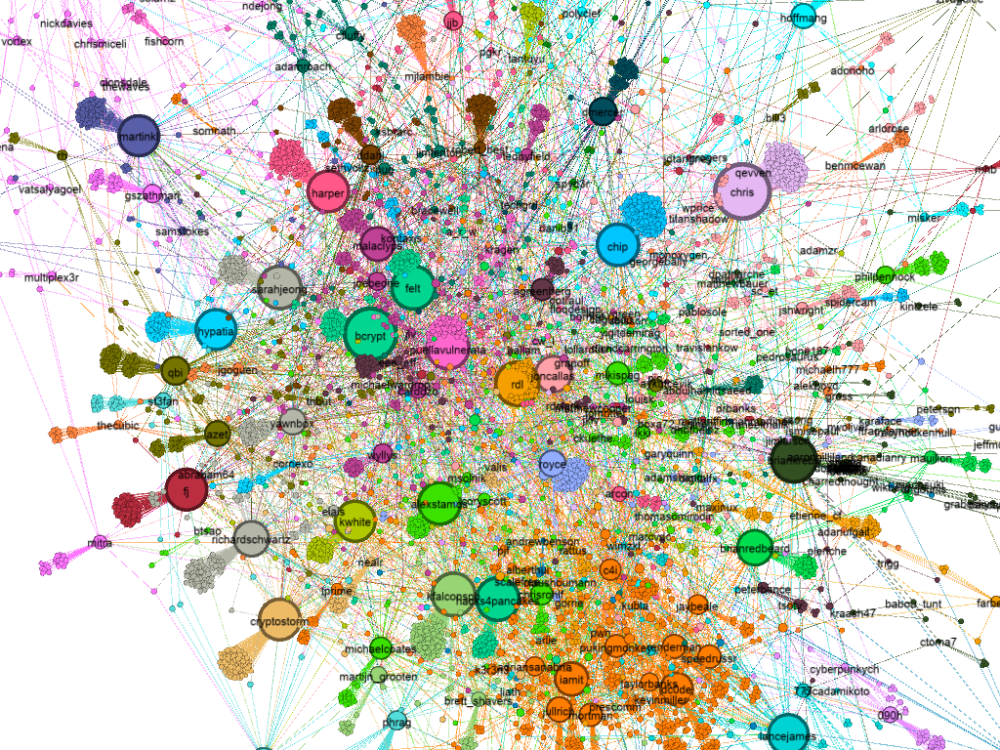
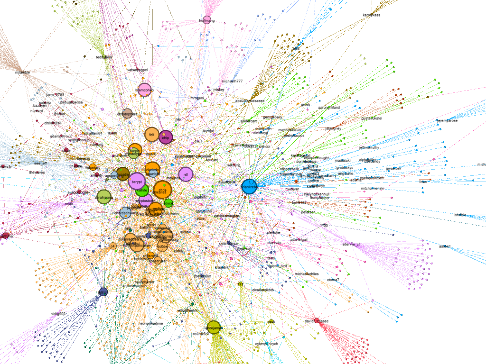

# Keybase Network Graph

Generate a [GraphML](http://graphml.graphdrawing.org/) graph datafile representing the [Keybase.io](https://keybase.io) 
network based on an origin Keybase user id value.

### Usage
**Step 1:** Determine the user id (uid) you wish to center the network graph data collection around.  This is easily 
achieved by visiting [Keybase.io](https://keybase.io) for the user, reviewing any element in the user **chain** and 
finding the `uid` value from the JSON payload data shown.

**Step 2:** Run `keybase-network-graph.py` as per the example below, start small `--depth=1` since the networks can 
blow out very large very quickly.  The tool is single threaded so it will take some time collecting all the required
data.  Data is stored in the `--path` so no Keybase data should be requested more than once. 

**Step 3:** Load the output GraphML file in Gephi (like Photoshop for graphs) - GraphML has the broadest set of 
graph features supported in Gephi hence the data-format choice.

**Step 4:** Explore the data set...


### Example
```commandline
$ ./keybase-network-graph.py --uid 3195b4ddeb6f4c4250ab2b5ff7c68b19 --depth 1

processing:3195b4ddeb6f4c4250ab2b5ff7c68b19 depth:0 uid_total:1
complete:3195b4ddeb6f4c4250ab2b5ff7c68b19 followers_added:17
...
processing:96ef480ac888bdff3ecb2a8f6e368b00 depth:1 uid_total:326
complete:96ef480ac888bdff3ecb2a8f6e368b00 followers_added:0

GraphML file: /tmp/keybase-network-graph/3195b4ddeb6f4c4250ab2b5ff7c68b19.graphml
```  

### Command Line Arguments
```commandline
$ ./keybase-network-graph.py -h
usage: keybase-network-graph.py [-h] --uid <uid> [--depth <depth>]
                                [--path <path>] [--nograph]
Keybase Network Grapher

optional arguments:
  -h, --help       show this help message and exit
  --uid <uid>      Initial uid to start collecting data on, required.
  --depth <depth>  Maximum depth of user connections to collect data on,
                   default = 1
  --path <path>    Maximum depth of user connections to collect data down to,
                   default = /tmp/keybase-network-graph
  --nograph        Prevent GraphML generation.
```

### Gephi Hints
**Learn to use the "Ego Filter"**

An Ego Filter allows you to filter out the noise from a graph focusing in on just one node, this helps focus your 
visualisations - [article here on Ego Filters](https://markhneedham.com/blog/2012/04/30/gephi-centring-a-graph-around-an-individual-node/)

**Use the username label**

The `username` label can be enabled using the icons at the bottom of the visualisation, the following Youtube video may
help - https://www.youtube.com/watch?v=eu1mibcOrN0

**Other Gephi tutorials**

The following Gephi tutorial is also quite helpful - https://www.youtube.com/watch?v=dSx5_PjaWVE

**Issues with Gephi on Ubuntu**

Ubuntu 18.04 (and 18.10) does not run Gephi out of the box due to an incompatible default version of Java.  This can be
resolved by installing `openjdk-8-jdk` and updating the `alternatives` configuration as such
```commandline
sudo apt-get install openjdk-8-jdk

sudo update-java-alternatives --list

sudo update-alternatives --config javac
sudo update-alternatives --config java
```

### Gephi Visualization Samples of Keybase networks



